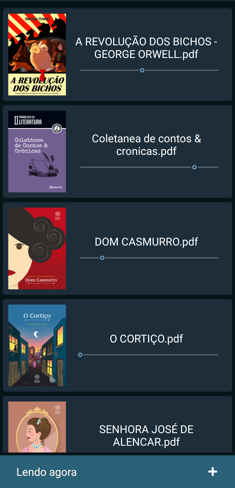
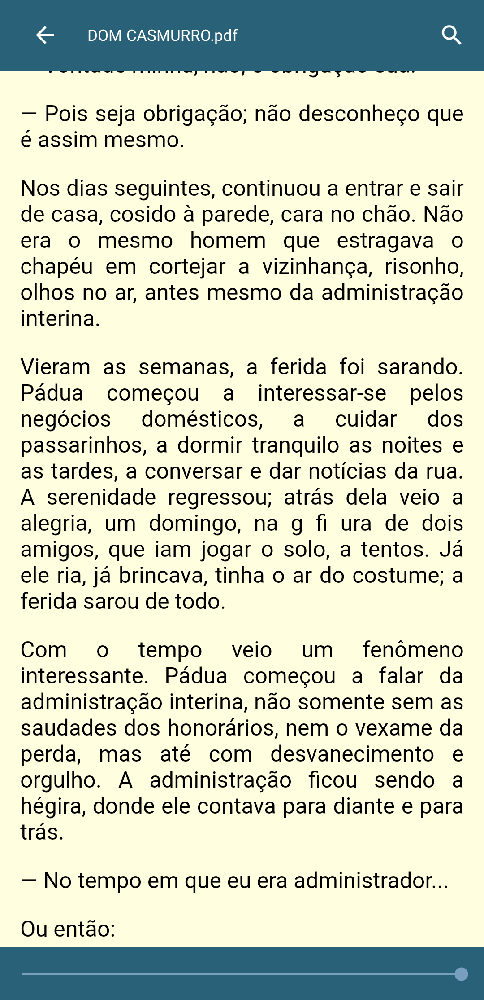
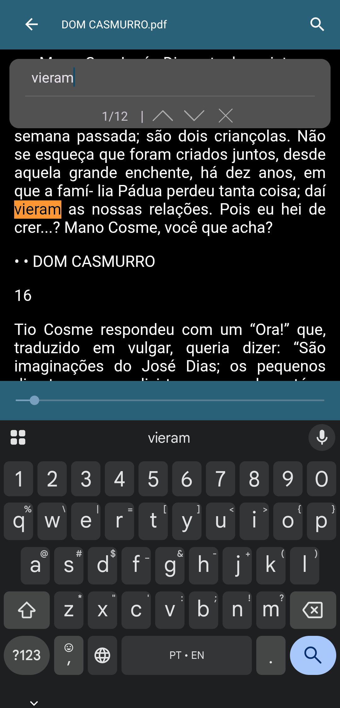
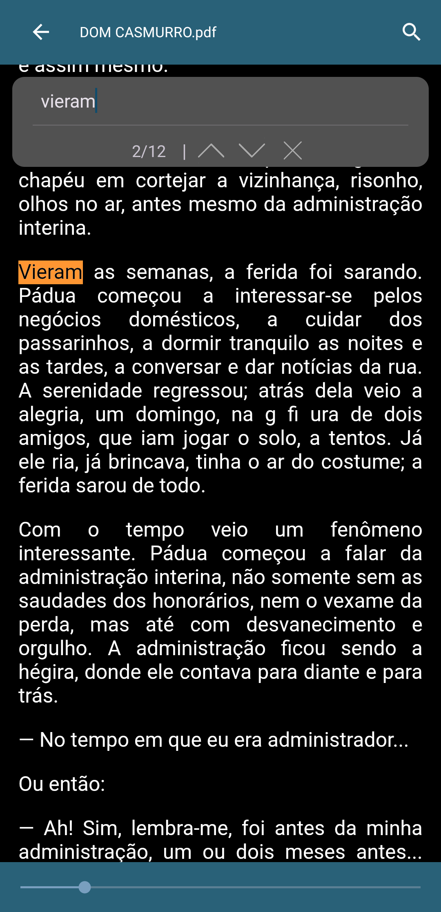

# Papyrus Reader

Um aplicativo nativo para Android que transforma a leitura de livros e documentos PDF em uma experiência simples, focada e personalizável. O Papyrus extrai o texto dos arquivos PDF e o exibe em um formato contínuo e ajustável (*reflow*), atuando como uma ferramenta avançada de estudos otimizada para telas de celular.

---

## Funcionalidades Principais

- **Modo de Leitura Imersivo e Customizável**: Texto extraído em HTML renderizado em `WebView`. Oculta os botões virtuais do sistema e permite ajustar o tamanho da fonte, alternar a tipografia (Serif / Sans-serif) e escolher a cor de fundo (sincronizada com o modo escuro do sistema ou seleção manual).
- **Motor de Busca Interno**: Barra de pesquisa flutuante para encontrar palavras-chave com destaque visual, navegação rápida (Próximo/Anterior) e contador dinâmico de resultados.
- **Biblioteca Inteligente**: Organização em padrão LIFO (últimos abertos no topo) com interface amigável de *Empty State* e *Loading* dinâmico.
- **Gerenciamento Seguro**: Exclusão de livros por gesto (*Swipe to Delete*) com recurso de segurança para "Desfazer" (*Undo*) via Snackbar.
- **Alta Performance**: Extração assíncrona de texto rodando em *Background* (Multithreading) para evitar travamentos ao importar PDFs pesados.
- **Progresso Contínuo**: Salva automaticamente a última posição de rolagem e a barra de progresso (SeekBar) para continuar a leitura exatamente de onde parou.

---

## Capturas de Tela
<p align="center">
  
  
  
  
  
  
  
</p>

---

## Instalação e Uso

1. **[Baixar APK](https://drive.google.com/file/d/1_R-sVsCyWLdCobtjYUZT6uMwHgH1W8Kq/view?usp=drive_link)**
2. **Instalar no dispositivo**: Habilite a instalação de fontes desconhecidas nas configurações do seu Android.
3. **Abrir o aplicativo**:
    - Toque no botão de adicionar para importar um arquivo `.pdf` do seu armazenamento.
    - Toque no livro para iniciar a leitura.
    - Use o ícone de engrenagem para customizar a fonte e as cores.
    - Deslize o livro para o lado na tela inicial caso queira removê-lo.

---

## Para Desenvolvedores

**Linguagem**: Java  
**SDK Alvo**: Android 15 (API 35)  
**Arquitetura**: UI nativa com `Activities`, `RecyclerView` e `WindowCompat` para controle de *Insets* (Edge-to-Edge).

### Processamento e Performance
- **[iTextG](https://itextpdf.com/)**: Biblioteca otimizada para Android utilizada para a extração do conteúdo de texto puro.
- **Multithreading**: O processamento de páginas utiliza `Executors.newFixedThreadPool()` para não bloquear a *Main Thread* (UI) durante a extração de livros grandes.
- **`android.graphics.pdf.PdfRenderer`**: API nativa para renderizar a primeira página em `Bitmap`, gerando as miniaturas da biblioteca de forma eficiente.

### Banco de Dados
- **[Room Persistence Library](https://developer.android.com/training/data-storage/room)**: Camada de abstração sobre o SQLite para armazenar metadados, caminho das miniaturas, preferências de leitura, conteúdo extraído e a última posição da barra de rolagem.

### Como Compilar Localmente

1. Clone o repositório:
   ```bash
   git clone [https://github.com/VictoriaCMoraes/PapyrusReader](https://github.com/vchristina02/PapyrusReader)